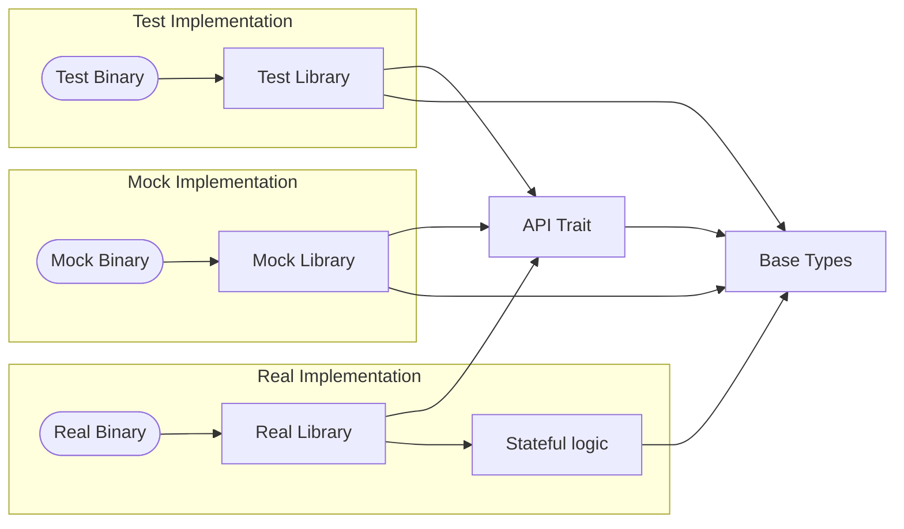

🚧 Work in progress! 🚧

# Nodal

Nodal is a general-purpose framework for creating RPC-like APIs in Rust using
NATS messaging. It also happens to be good for building robot software.

A key feature is the separation of the API from the implementation, allowing multiple implementations for a single API.

# Requests for Discussion

The design development is captured with an RFD process outlined in [RFD 1
Requests for Discussion](<rfd/RFD 1 Requests for Discussion.md>). Please note that
some features may not be implemented yet even if they are present in RFD
documents.
